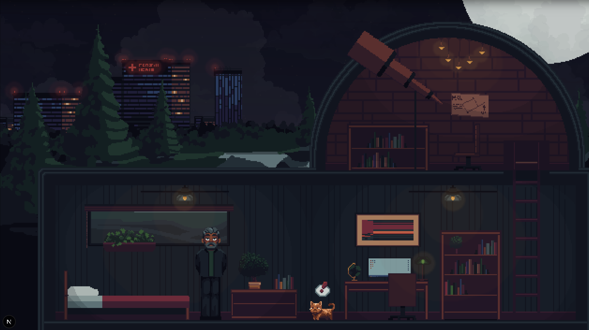
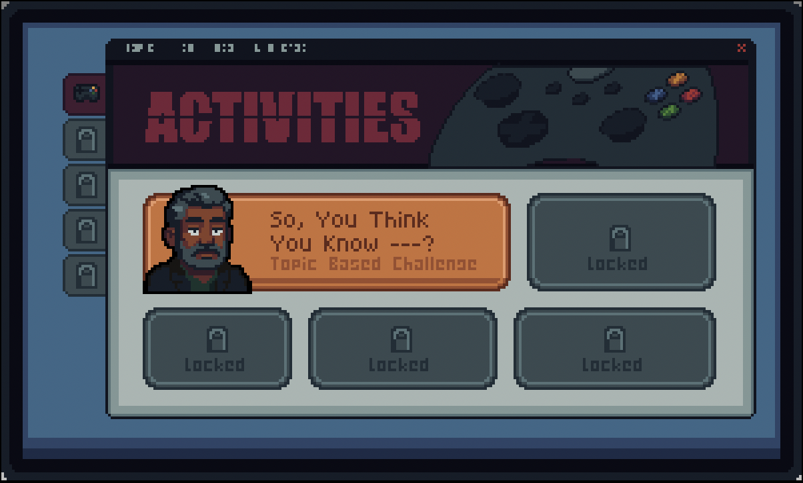

# MEDICAL PHYSICS TOOLKIT HUB




## FOR AI ASSISTANTS
You're developing a medical physics consultation toolkit (FastAPI + Next.js).
Start here, then navigate to specific docs as needed.

## QUICK NAVIGATION
- **Building module?** → PATTERNS.md
- **Module spec?** → SPRITES.md
- **Bug/TODO?** → STACK.md
- **Why decision made?** → ARCHITECTURE.md
- **Session done?** → DEV_LOG.md

## CRITICAL WORKFLOW

### Before Coding
```bash
# 1. Check environment (80% of "broken" code is wrong endpoint)
cat frontend/.env.local

# 2. Local dev should show:
NEXT_PUBLIC_API_URL=http://localhost:8000/api
```

### Before Deployment
```bash
# MUST switch to production URL before git push
echo "NEXT_PUBLIC_API_URL=https://residency-tk2-production.up.railway.app/api" > frontend/.env.local
git push origin main

# THEN switch back to local
echo "NEXT_PUBLIC_API_URL=http://localhost:8000/api" > frontend/.env.local
```

**Skipping this = production app breaks completely!**

## QUICK COMMANDS
```bash
./start.sh              # Start both services
./stop.sh               # Stop both services
cd backend && ./run_tests.sh          # Backend tests
python test_pacemaker_module.py       # Module tests
```

## DEBUGGING PRIORITY
1. **Check environment** (DevTools → Network tab, verify endpoint)
2. **Check backend logs** (terminal running uvicorn)
3. **Check frontend console** (DevTools → Console)
4. **Test backend directly** (http://localhost:8000/docs)

## WHEN STUCK
1. Search for similar module (Fusion is the gold standard)
2. Check PATTERNS.md for proven approaches
3. Verify environment configuration (it's usually this)

## SESSION LOGGING
Log every session in DEV_LOG.md:
```markdown
## Entry #[NUMBER]
**Focus:** [What we're building/fixing]
**Smooth:** [What worked well]
**Friction:** [Challenges + solutions]
**Insight:** [Key learning]
```

## CRITICAL REMINDERS
- **HIPAA:** Always use `---` placeholder for patient names
- **Grammar:** "An MRI" not "A MRI", "deformable registration" not "enhancement"
- **Backend wins:** Never override backend text in frontend
- **3-column layout:** Always-visible results, no scrolling
- **Test end-to-end:** Backend logs lie, frontend display is truth

## DOCUMENTATION VERSIONS
- HUB: v1.1 (Dec 2025)
- ARCHITECTURE: v1.1 (Dec 2025)
- PATTERNS: v1.1 (Dec 2025)
- SPRITES: v1.1 (Dec 2025)
- STACK: v1.1 (Dec 2025)
- DEV_LOG: Rolling (wiped periodically)
- Last updated: December 17, 2025

